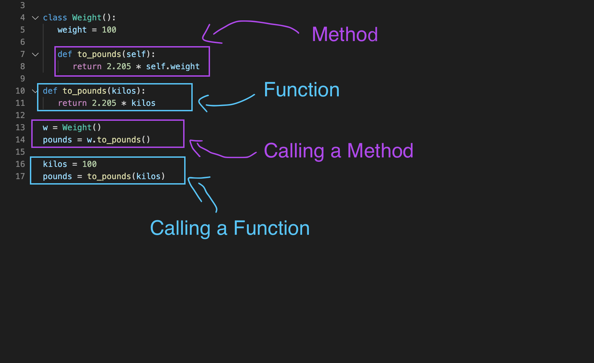

# Python Class

### Instantiating Classes

When we ***call*** a class, a class ***instance*** object is created.

This class instance object has its own **namespace** NOT same as namespace of ***class***

class instance object's attributes:

- `__dict__` is the object's local **namespace**
- `__class__` tells us **which** **class was used** to instantiate the object (`obj.__class__` is equivalent to `type(obj)`)

~~~python
class MyClass:
    language = 'Python'

# 1. Calling Class attribute.
obj = MyClass()
print("*** Take One ***")
print("Class Dict:", MyClass.__dict__["language"])
try: print("Object Dict:",obj.__dict__["language"])
except Exception: print("No Object attribute.", obj.language)
print("")

# 2. Add instance attribute to object.
obj.language = "Java"
print("*** Take Two ***")
print("Class Dict:", MyClass.__dict__["language"])
print("Object Dict:",obj.__dict__["language"])
print("")
~~~


## Difference?

~~~python
class MyClass:
    language = "Python"
    version = "3.6"

    def __init__(self, *args):
        for i in enumerate(args):
            self.type = i[0]
            self.version = i[1]


myObj = MyClass("Django", "1.2")
print(myObj.version)
~~~

>   Answer: myObj is an instance of MyClass. Therefore, the "version" attribute is myObj's attribute. Hence, output is 1.2.

**Tip**: if you want you **access the attribute of class**, use `print(MyClass.version)`.


## methods: attr()

```python
getattr(MyClass, 'language') 	-> 'Python'
getattr(MyClass, 'name')		-> AttributeErrorException
getattr(MyClass, 'name', 'N/A')	-> 'N/A'

setattr(MyClass, 'language', 'java')
delattr(MyClass, 'language')
```

`getattr(Myclass, 'language')` is equivalent to  `Myclass.language`


# instanitation(인스턴스화) vs initialization(초기화)?

> **Answer**: Memory is allocated for object vs value.

### Deep Dive (for better unstanding, used C++ example)

#### Variables are Initialized

All variables are always given an *initial* value at the point the variable is *declared*. Thus all variables are ***initialized***.

> **Warning**: This only refers to C++. Python prefers "**Assignment**" instead of declaration.

For *value* types, like `int` the compiler will give them a valid value if you do not do so explicitly. `int`'s ***initialize*** to zero by default, `DateTime`'s ***initialize*** to `DateTime.MinValue` by default.

*Reference* type variables ***initialize*** to the object you give it. The compiler will not ***assign*** an object (i.e. a valid value) if you don't. In this case the value is `null` - nothing. So we say that the reference is ***initialized*** to null.

#### Objects are Instantiated

Humans are born. Objects are instantiated. A baby is an *instance* of a Human, an object is an *instance* of some Class.

**<u>The act of creating an *instance* of a Class</u>** is called ***instantiation*** (Ta-Da!)


#### So *declare*, *initialize*, and *instantiate* come together like this

```java
MyClass myClassyReference = new MyClass();
```

**In the above, it is wrong to say "... creating an instance of an *object*..."**

------

Three distinct things are going on (above) using distinct terminology and that terminology is not interchangeable :

1. A reference variable is declared - `MyClass myClassyReference`
2. An object is instantiated (...from/of a given *class*, implied) - `new MyClass()`
3. The object is **assigned** to the variable. `=`.


# Functional Attributes

~~~python
MyClass.say_hello 				<function __main__.MyClass.say_hello()>
my_obj.say_hello 				<bound method MyClass.say_hello of <__main__.MyClass
								object at 0x10383f860>>

Same with getattr:
getattr(my_obj, 'say_hello') 	<bound method MyClass.say_hello of <__main__.MyClass
								object at 0x10383f860>>
    
MyClass.say_hello() 			->'Hello World!'

my_obj.say_hello() 				-> TypeError
                                    say_hello() takes 0 positional
                                    arguments but 1 was given
bound? method?
~~~


#### What's Actually Happening

> `say_hello` has access to the **bound object's namespace**. Important.


#### So, what are methods?

- instance (of some class)
- function
- uses object as an first argument so that **methods bound to the instance of class**.

just like any object, it has attributes

- `__self__`
- `__func__`


~~~python
class Person:
    def hello(self):
        pass

p = Person()

print(p.hello)
# <bound method Person.hello of <__main__.Person object at 0x000002912F87F8D0>>

print(Person.hello)
print(p.hello.__func__)
# <function Person.hello at 0x000002912F881620>
# <function Person.hello at 0x000002912F881620>

print(p)
print(p.hello.__self__)
# <__main__.Person object at 0x000002912F87F8D0>
# <__main__.Person object at 0x000002912F87F8D0>
~~~

**Function vs Method**

> `def hello(self)` itself is just a **function within a class** but changes to `instance method `when its **bound to an object.**

> This means **methods** can **ACCESS TO ATTRIBUTE OF INSTANCE** while **functions** can't.



which is equivalent to `MyClass.say_hello(my_obj)`


# Method Objects

### Creating Method Object

~~~python
p1 = MyClass("Nam")
p2 = MyClass("Sue")

def say_hi(self):
    return f'{self.name} says hi!'

p1_say_hi = MethodType(say_hi, p1)
print(p1_say_hi)

Output:
<bound method say_hi of <__main__.MyClass object at 0x000001290AABD250>>
~~~


## Bound to an object

~~~python
print(p1.__dict__)

Output:
# say_hi is not bound to an object
{'name': 'Nam'}
~~~

~~~python
p1.p1_say_hi_method = p1_say_hi
print(p1.say_hi())
print(p1.__dict__)

Output:
Nam says hi!
{'name': 'Nam', 'p1_say_hi_method': <bound method say_hi of <__main__.MyClass object at 0x000002BBE380EE50>>}
~~~

### All this is equivalent to

~~~python
p1.say_hello = MethodType(lambda self: f'{self.name} says hello!', p1)
~~~

